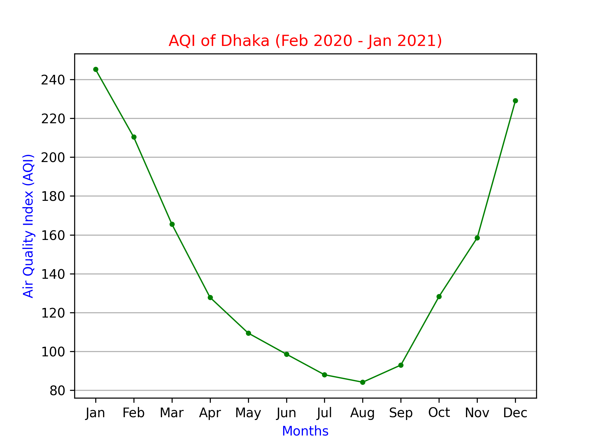
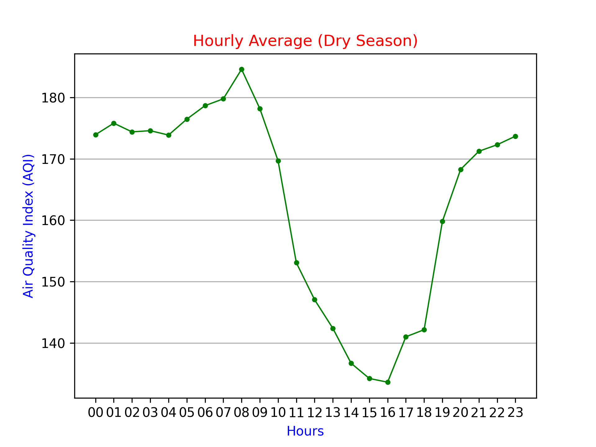
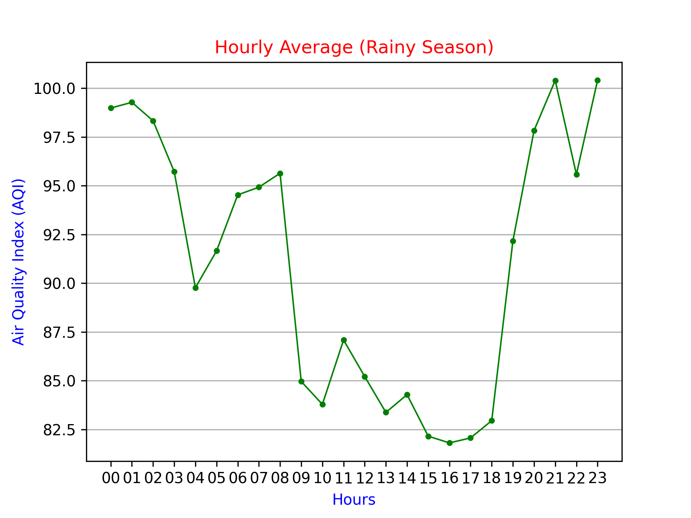
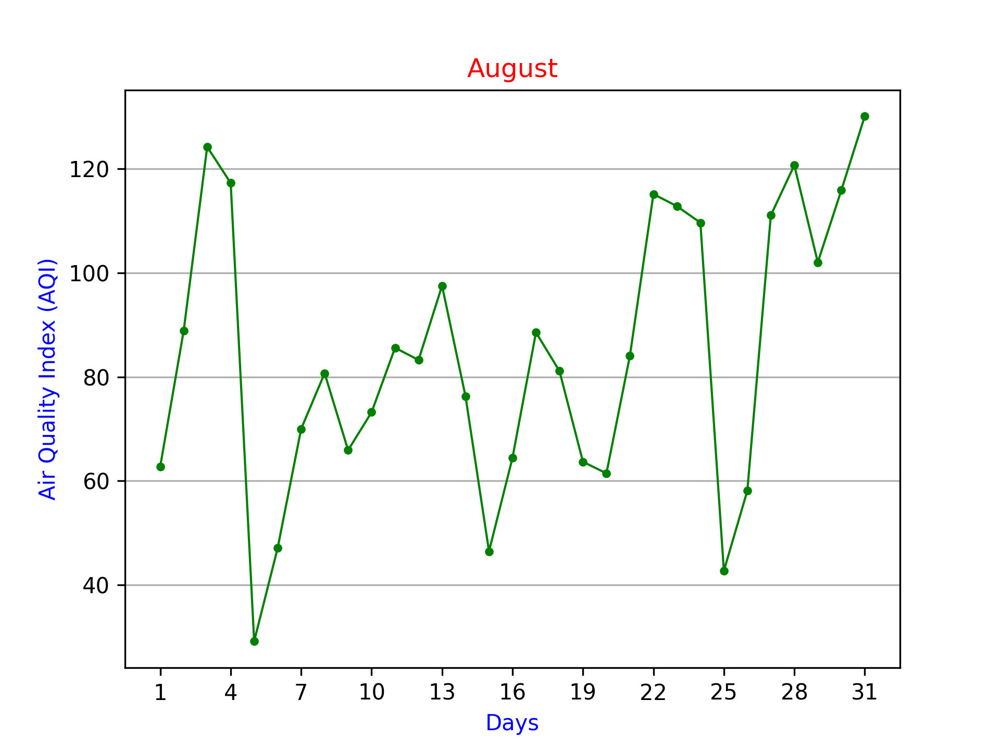

# Air Quality Index (AQI)
Fetch AQI from IQAir and store in a SQLite database.

The script `main.py` will fetch and store AQI once and die. To continuously fetch and store the data, it needs to be run every hour, which can be done using Crontab.

### Initialization

- Run `create_db.py` to create the database initially.
- Run `show_data.py` to see information from the database.

### Visualizing data

A visualization script is available in `visualization/` folder. It might need some tweaking according to the needs. The script can read a CSV file as data source. SQLite db can also be used with some minor tweaking.

All the graphs shown below ranges from February 2020 to January 2021

#### Monthly average AQI of Feb 2020 – Jan 2021

-------------------------------------------

#### Hourly average AQI of Dry and Rainy season

-------------------------------------------

#### December, one of the worst month of the year

#### August, one of the best month of the year

